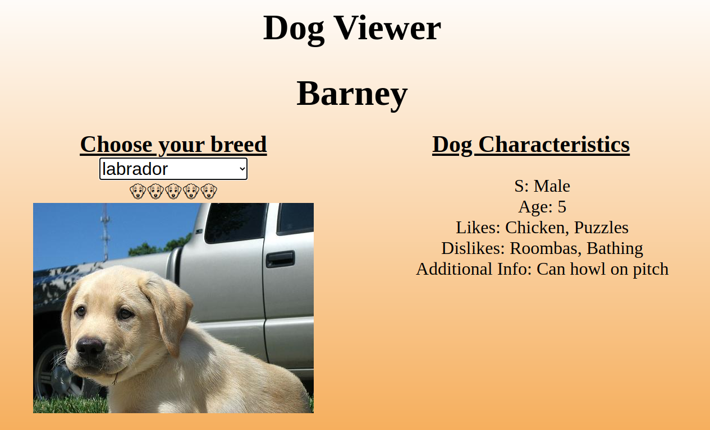

# dog-generator

A website in which the user can select a dog breed and it will return a picture of the dog based on the beed selected, a name of the dog that matches its gender, age, and couple of extra fun facts about them such as their likes and dislikes. 

**Link to project:** https://brianbud.github.io/dog-generator/

## How It's Made: 

**Tech used:** HTML, CSS and JavaScript

## Lessons Learned:

Going through this project I learnt a ton such as: 

* Learnt how to Fetch API(pun intended) and use JSON to extract the dog data. API used is called [dog.ceo](https://dog.ceo/dog-api/)
* My first time learning about the Fisher-Yates Shuffle Algorithm and why it's a preffered way to shuffle through an array to pick multiple random elements. 
* Object.keys() method to return an array with the property names/keys. 
* appendChild() method to add a new element 
* getElementId() and innerHTML to display data on the website